# Score - Architecture Documentation

## Overview

Score is a game clock application with event sourcing capabilities. It tracks game time through discrete events (start, pause, clock set) and maintains a delivery system to push these events to external destinations.

## System Components


## Process Architecture

The application uses a **multi-process architecture** for isolation and performance:

```mermaid
graph LR
    subgraph "Main Process (PID: xxxxx)"
        Main[Main App]
        FastAPI[FastAPI Server]
        WebView[WebView Window]
    end

    subgraph "Child Process (PID: yyyyy)"
        Pusher[Event Pusher]
    end

    Main -->|spawn| Pusher
    Main -->|monitors via<br/>is_alive()| Pusher

    style Main fill:#4ade80
    style Pusher fill:#fbbf24
```

### Why Separate Processes?

1. **Isolation** - Event pusher failures don't crash the main app
2. **Performance** - File I/O doesn't block the UI/game loop
3. **Monitoring** - Easy health checks via process status
4. **Clean Shutdown** - Processes can be terminated independently

## Database Schema


### Event Types

- `CLOCK_SET` - Clock time changed (payload: `{"seconds": N}`)
- `GAME_STARTED` - Game clock started
- `GAME_PAUSED` - Game clock paused

### Delivery Status

- `NULL` or missing - Not yet attempted
- `1` - Successfully delivered
- `2` - Failed delivery (will retry)

## Event Flow


## State Management

The application uses **event sourcing** to maintain state:


### State Replay Logic

```python
# Pseudocode for state replay
for event in events_ordered_by_time:
    if event.type == "CLOCK_SET":
        state.seconds = event.payload.seconds

    elif event.type == "GAME_STARTED":
        state.running = True
        state.last_update = event.created_at

    elif event.type == "GAME_PAUSED":
        if state.running:
            elapsed = event.created_at - state.last_update
            state.seconds -= elapsed
        state.running = False
        state.last_update = event.created_at

# Adjust for current wall time if still running
if state.running:
    elapsed = now() - state.last_update
    state.seconds -= elapsed
```

## Logging Architecture

The application uses **queue-based logging** to coordinate output from multiple processes:


### Log Flow

1. **Main Process** logs directly to Rich console handler
2. **Pusher Process** sends log records to shared queue
3. **Queue Listener** (in main process) reads from queue
4. **Queue Listener** forwards records to Rich handler
5. All logs appear in same console, properly serialized

### Log Format

```
[HH:MM:SS] [PID: 12345 TID: 67890] Message text                    logger.name
```

## Status Indicator System

The UI displays real-time event pusher status with a three-state indicator:

```mermaid
stateDiagram-v2
    [*] --> Unknown: App Start
    Unknown --> Healthy: Process alive<br/>+ No pending events
    Unknown --> Pending: Process alive<br/>+ Has pending events
    Unknown --> Dead: Process not alive

    Healthy --> Pending: New event created
    Pending --> Healthy: All events delivered

    Healthy --> Dead: Process crashes
    Pending --> Dead: Process crashes

    Dead --> [*]: App shutdown

    note right of Unknown
        Gray indicator ⚪
    end note

    note right of Healthy
        Green indicator 🟢
        Process alive
        No pending events
    end note

    note right of Pending
        Yellow indicator 🟡
        Process alive
        Events waiting
    end note

    note right of Dead
        Red indicator 🔴
        Process crashed
    end note
```



### Status Determination Logic

```python
# Executed every 1 second in game loop
if pusher_process is None:
    status = "unknown"
elif not pusher_process.is_alive():
    status = "dead"
elif has_undelivered_events():
    status = "pending"
else:
    status = "healthy"
```

### Status Query

```sql
-- Check for undelivered events
SELECT COUNT(*) FROM events e
LEFT JOIN deliveries d ON e.id = d.event_id
    AND d.destination = ?
WHERE d.event_id IS NULL      -- Never delivered
   OR d.delivered IN (0, 2)    -- Failed delivery
```

## WebSocket Communication


### State Message Format

```json
{
  "state": {
    "seconds": 1200,
    "running": false,
    "pusher_status": "healthy"
  }
}
```

## Game Loop


## Event Pusher Details


### Delivery Format (JSONL)

Each event is written as a single line of JSON:

```json
{"event_id": 1, "event_type": "CLOCK_SET", "event_payload": {"seconds": 1200}, "event_timestamp": 1706745600}
{"event_id": 2, "event_type": "GAME_STARTED", "event_payload": {}, "event_timestamp": 1706745610}
{"event_id": 3, "event_type": "GAME_PAUSED", "event_payload": {}, "event_timestamp": 1706745670}
```

## Key Design Decisions

### 1. Event Sourcing

**Why**: Provides complete audit trail, enables replay, supports multiple delivery destinations

**Trade-offs**: More complex than direct state updates, requires careful replay logic

### 2. Separate Process for Pusher

**Why**: Isolation, performance, health monitoring

**Trade-offs**: More complex IPC, logging coordination needed

### 3. Queue-Based Logging

**Why**: Prevents log interleaving, maintains consistent format

**Trade-offs**: Slight overhead, requires cleanup on shutdown

### 4. Polling vs. Notification

**Why**: Event pusher polls database every 0.5s instead of being notified

**Rationale**: Simple, reliable, acceptable latency for this use case

**Alternative**: Could use SQLite triggers + Unix sockets for push model

### 5. Three-State Status Indicator

**Why**: Distinguishes between "working" (yellow) and "idle" (green)

**Benefit**: User knows if events are queued vs. fully synced

## Testing Strategy

### Unit Tests

- `has_undelivered_events()` - Database query correctness
- Status determination logic - State machine transitions
- Event replay logic - State reconstruction

### Integration Tests (Existing)

- Event pusher end-to-end flow
- Delivery tracking
- Retry logic
- Multi-destination support

### Not Currently Tested

- WebSocket communication
- Process spawning/health checks
- UI interactions

## Future Enhancements

### Potential Improvements

1. **Multiple Destinations** - Support pushing to webhooks, APIs, etc.
2. **Event Filtering** - Allow destinations to subscribe to specific event types
3. **Backpressure** - Limit queue size if pusher falls behind
4. **Metrics** - Track delivery latency, success rates
5. **Dead Letter Queue** - Move permanently failed events
6. **Configuration** - Make polling interval, retry logic configurable

### Architectural Changes

1. **Notification-Based Pushing** - Replace polling with push model
2. **Batch Delivery** - Send multiple events per write operation
3. **Event Versioning** - Support schema evolution
4. **Snapshotting** - Store periodic state snapshots to speed replay

## Performance Characteristics

### Current Performance

- **Game Loop**: 1 Hz (updates every second)
- **Event Pusher**: Polls every 0.5s
- **Max Delivery Latency**: ~500ms (polling interval)
- **Database**: SQLite with 5s lock timeout
- **Replay Time**: O(n) where n = number of events

### Scaling Considerations

- SQLite suitable for single-user, local deployment
- For multi-user: consider PostgreSQL + WebSocket scaling
- Event count grows unbounded - consider archival strategy
- Rich logging has overhead - use plain format for high-throughput

## Dependencies


## Conclusion

Score demonstrates a clean separation between concerns:

- **UI Layer** - Web-based, reactive
- **State Management** - Event sourced, replayable
- **Delivery System** - Isolated, monitored
- **Logging** - Coordinated, formatted

The architecture prioritizes **reliability** (process isolation), **observability** (rich logging, status indicators), and **correctness** (event sourcing, delivery tracking).
