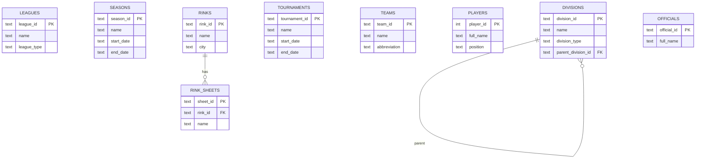
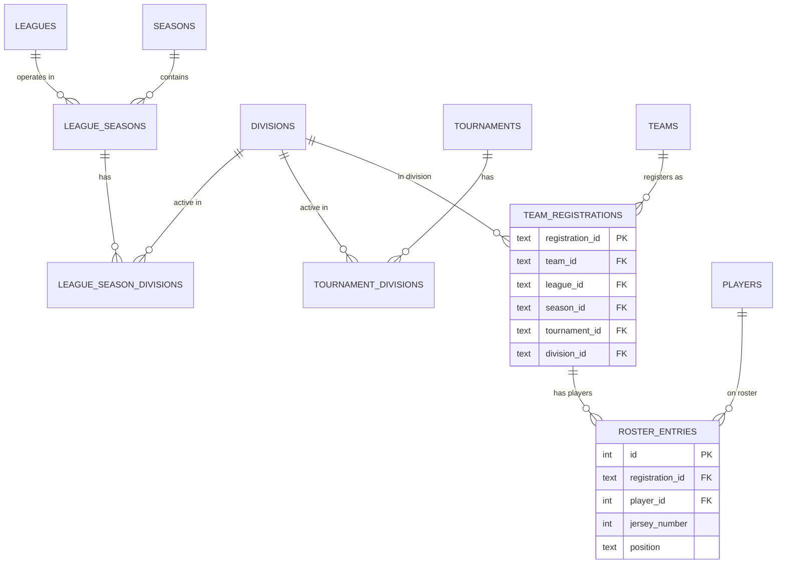
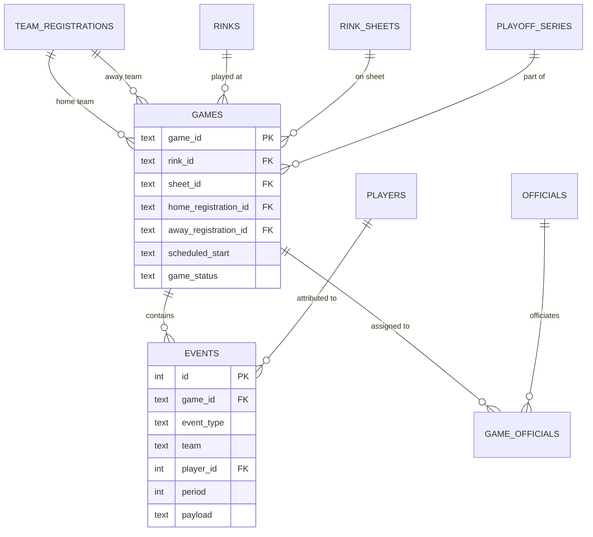
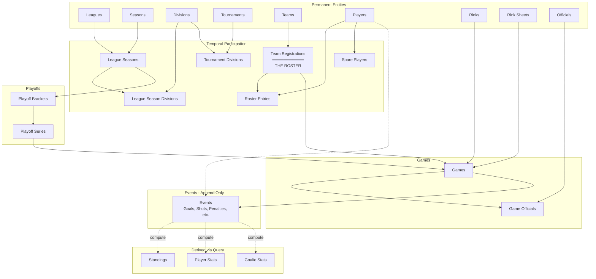

# Score Data Model

**Version**: 2.0
**Date**: 2026-02-03
**Philosophy**: Event sourcing - all state derived from append-only events

---

## Table of Contents

1. [Design Principles](#design-principles)
2. [Entity Overview](#entity-overview)
3. [Schema](#schema)
4. [Event Types](#event-types)
5. [Derived Data](#derived-data)
6. [Entity Relationships](#entity-relationships)

---

## Design Principles

### 1. Event Sourcing
- Events are **append-only** - never modified or deleted
- State is **derived** by replaying events
- No tables for computed data (standings, stats) - compute via queries

### 2. Temporal Modeling
- Permanent entities (leagues, teams, players) exist independently
- Temporal participation links entities to time periods
- A **Roster = Team-in-Time** (team registration + roster entries)

### 3. Separate Concepts
- Leagues, seasons, divisions are independent concepts
- They reference each other through association tables
- Flexible: supports pro leagues, rec leagues, and tournaments

### 4. No Authentication
- Public data only
- Admin access via simple password protection (not user accounts)

---

## Entity Overview

### Permanent Entities (exist independently)

| Entity | Description |
|--------|-------------|
| `leagues` | Organizations that run competitions |
| `seasons` | Time periods (can be shared across leagues) |
| `divisions` | Team groupings (conferences, divisions, brackets) |
| `tournaments` | Time-bound events (alternative to league+season) |
| `teams` | Team organizations |
| `players` | Individual athletes |
| `rinks` | Physical venues |
| `rink_sheets` | Ice surfaces within a rink |
| `officials` | Referees and linesmen |

### Rule Configuration

| Entity | Description |
|--------|-------------|
| `rule_sets` | League rule configurations (period length, point system, etc.) |
| `rule_set_infractions` | Infractions defined for a rule set with durations |

### Temporal Participation (links entities to time)

| Entity | Description |
|--------|-------------|
| `league_seasons` | League operates during a season |
| `league_season_divisions` | Division active in a league+season |
| `tournament_divisions` | Division active in a tournament |
| `team_registrations` | Team competing in a context = **THE ROSTER** |
| `roster_entries` | Player on a team's roster for a period |
| `spare_players` | Players available to sub |

### Games

| Entity | Description |
|--------|-------------|
| `games` | Scheduled/completed games |
| `game_officials` | Officials assigned to games |

### Events (append-only log)

| Entity | Description |
|--------|-------------|
| `events` | All game events (goals, shots, penalties, etc.) |

### Playoffs

| Entity | Description |
|--------|-------------|
| `playoff_brackets` | Playoff structure |
| `playoff_series` | Series within a bracket |

---

## Schema

### Permanent Entities

```sql
-- Organizations that run competitions
CREATE TABLE leagues (
    league_id TEXT PRIMARY KEY,
    name TEXT NOT NULL,
    league_type TEXT,                -- "professional", "amateur", "rec"
    description TEXT,
    website TEXT,
    logo_url TEXT,
    created_at INTEGER NOT NULL
);

-- Time periods (independent of leagues)
CREATE TABLE seasons (
    season_id TEXT PRIMARY KEY,
    name TEXT NOT NULL,              -- "2025-2026", "Winter 2026"
    start_date TEXT NOT NULL,        -- ISO 8601
    end_date TEXT,
    created_at INTEGER NOT NULL
);

-- Team groupings (reusable across seasons)
CREATE TABLE divisions (
    division_id TEXT PRIMARY KEY,
    name TEXT NOT NULL,
    division_type TEXT,              -- "conference", "division", "bracket", "pool"
    parent_division_id TEXT,         -- For conference→division nesting
    description TEXT,
    created_at INTEGER NOT NULL,
    FOREIGN KEY (parent_division_id) REFERENCES divisions(division_id)
);

-- Time-bound events (alternative to league+season)
CREATE TABLE tournaments (
    tournament_id TEXT PRIMARY KEY,
    name TEXT NOT NULL,
    start_date TEXT NOT NULL,
    end_date TEXT NOT NULL,
    location TEXT,
    tournament_type TEXT,            -- "championship", "invitational", "playoff"
    description TEXT,
    created_at INTEGER NOT NULL
);

-- Team organizations
CREATE TABLE teams (
    team_id TEXT PRIMARY KEY,
    name TEXT NOT NULL,
    city TEXT,
    abbreviation TEXT,               -- "TOR", "MTL"
    team_type TEXT,                  -- "franchise", "club", "pickup"
    logo_url TEXT,
    primary_color TEXT,
    secondary_color TEXT,
    created_at INTEGER NOT NULL
);

-- Individual athletes
CREATE TABLE players (
    player_id INTEGER PRIMARY KEY,
    first_name TEXT NOT NULL,
    last_name TEXT NOT NULL,
    full_name TEXT NOT NULL,
    birth_date TEXT,
    birth_city TEXT,
    birth_country TEXT,
    height_inches INTEGER,
    weight_pounds INTEGER,
    shoots_catches TEXT,             -- "L", "R"
    public_email TEXT,               -- Optional, for spare contact
    public_phone TEXT,               -- Optional, for spare contact
    created_at INTEGER NOT NULL
);

-- Physical venues
CREATE TABLE rinks (
    rink_id TEXT PRIMARY KEY,
    name TEXT NOT NULL,
    address TEXT,
    city TEXT,
    province_state TEXT,
    postal_code TEXT,
    country TEXT,
    phone TEXT,
    website TEXT,
    parking_info TEXT,
    notes TEXT,
    created_at INTEGER NOT NULL
);

-- Ice surfaces within a rink
CREATE TABLE rink_sheets (
    sheet_id TEXT PRIMARY KEY,
    rink_id TEXT NOT NULL,
    name TEXT NOT NULL,              -- "Sheet A", "Main Rink"
    surface_type TEXT,               -- "NHL", "Olympic"
    capacity INTEGER,
    created_at INTEGER NOT NULL,
    FOREIGN KEY (rink_id) REFERENCES rinks(rink_id)
);

-- Referees and linesmen
CREATE TABLE officials (
    official_id TEXT PRIMARY KEY,
    first_name TEXT NOT NULL,
    last_name TEXT NOT NULL,
    full_name TEXT NOT NULL,
    certification_level TEXT,
    created_at INTEGER NOT NULL
);
```

### Rule Configuration

```sql
-- Rule sets define league-specific configurations
-- Scoring app loads these as presets for a game
CREATE TABLE rule_sets (
    rule_set_id TEXT PRIMARY KEY,
    name TEXT NOT NULL,              -- "NHL Rules", "Youth U12", "Adult Rec"
    description TEXT,

    -- Game structure
    num_periods INTEGER DEFAULT 3,
    period_length_min INTEGER DEFAULT 20,
    intermission_length_min INTEGER DEFAULT 15,
    overtime_length_min INTEGER,     -- NULL if no overtime
    overtime_type TEXT,              -- "sudden_death", "full_period", NULL

    -- Gameplay rules
    icing_rule TEXT DEFAULT 'hybrid', -- "touch", "hybrid", "no_touch"
    offside_rule TEXT DEFAULT 'standard', -- "standard", "no_offside"
    body_checking INTEGER DEFAULT 1, -- 0 = no body checking (kids leagues)

    -- Point system for standings
    points_win INTEGER DEFAULT 2,
    points_loss INTEGER DEFAULT 0,
    points_tie INTEGER DEFAULT 1,
    points_otl INTEGER DEFAULT 1,    -- Overtime loss

    -- Roster rules
    max_roster_size INTEGER,
    min_players_to_start INTEGER,
    max_players_dressed INTEGER,

    created_at INTEGER NOT NULL
);

-- Infractions defined per rule set
-- Allows different leagues to have different penalty types/durations
CREATE TABLE rule_set_infractions (
    id INTEGER PRIMARY KEY AUTOINCREMENT,
    rule_set_id TEXT NOT NULL,

    code TEXT NOT NULL,              -- "TRIP", "HOOK", "SLASH", "ROUGH"
    name TEXT NOT NULL,              -- "Tripping", "Hooking", "Slashing"
    description TEXT,

    -- Default penalty settings
    default_severity TEXT NOT NULL,  -- "minor", "major", "misconduct", etc.
    default_duration_min INTEGER NOT NULL,

    -- Can this infraction result in different severities?
    allows_minor INTEGER DEFAULT 1,
    allows_major INTEGER DEFAULT 0,
    allows_misconduct INTEGER DEFAULT 0,
    allows_match INTEGER DEFAULT 0,

    -- Is this infraction active for this rule set?
    is_active INTEGER DEFAULT 1,

    display_order INTEGER,

    UNIQUE(rule_set_id, code),
    FOREIGN KEY (rule_set_id) REFERENCES rule_sets(rule_set_id)
);

CREATE INDEX idx_infractions_rule_set ON rule_set_infractions(rule_set_id);
```

### Example Rule Sets

```sql
-- Adult recreational league
INSERT INTO rule_sets VALUES (
    'adult-rec',
    'Adult Recreational',
    'Standard adult rec league rules - no checking',
    3,      -- periods
    15,     -- period length
    5,      -- intermission
    5,      -- overtime length
    'sudden_death',
    'hybrid', 'standard',
    0,      -- NO body checking
    2, 0, 1, 1,  -- points
    25, 8, 16,   -- roster limits
    1706918400
);

-- Youth U12
INSERT INTO rule_sets VALUES (
    'youth-u12',
    'Youth U12',
    'Youth under-12 rules',
    3,
    12,     -- shorter periods
    3,
    NULL,   -- no overtime (ties allowed)
    NULL,
    'no_touch', 'standard',
    0,      -- no checking
    2, 0, 1, 0,
    20, 6, 15,
    1706918400
);

-- Example infractions for adult rec
INSERT INTO rule_set_infractions (rule_set_id, code, name, default_severity, default_duration_min, allows_major, display_order)
VALUES
    ('adult-rec', 'TRIP', 'Tripping', 'minor', 2, 0, 1),
    ('adult-rec', 'HOOK', 'Hooking', 'minor', 2, 0, 2),
    ('adult-rec', 'HOLD', 'Holding', 'minor', 2, 0, 3),
    ('adult-rec', 'SLASH', 'Slashing', 'minor', 2, 1, 4),
    ('adult-rec', 'INTRF', 'Interference', 'minor', 2, 0, 5),
    ('adult-rec', 'ROUGH', 'Roughing', 'minor', 2, 1, 6),
    ('adult-rec', 'HSTCK', 'High Sticking', 'minor', 2, 1, 7),
    ('adult-rec', 'CROSS', 'Cross Checking', 'minor', 2, 1, 8),
    ('adult-rec', 'ELBOW', 'Elbowing', 'minor', 2, 1, 9),
    ('adult-rec', 'BOARD', 'Boarding', 'minor', 2, 1, 10),
    ('adult-rec', 'DELAY', 'Delay of Game', 'minor', 2, 0, 11),
    ('adult-rec', 'TMPEN', 'Too Many Men', 'minor', 2, 0, 12),
    ('adult-rec', 'UNSPT', 'Unsportsmanlike', 'minor', 2, 0, 13),
    ('adult-rec', 'MISCD', 'Misconduct', 'misconduct', 10, 0, 14),
    ('adult-rec', 'GMCON', 'Game Misconduct', 'game_misconduct', 0, 0, 15),
    ('adult-rec', 'FIGHT', 'Fighting', 'major', 5, 0, 16);

-- Youth leagues might not have fighting penalty
INSERT INTO rule_set_infractions (rule_set_id, code, name, default_severity, default_duration_min, display_order)
VALUES
    ('youth-u12', 'TRIP', 'Tripping', 'minor', 1, 1),  -- 1 min penalties
    ('youth-u12', 'HOOK', 'Hooking', 'minor', 1, 2),
    ('youth-u12', 'HOLD', 'Holding', 'minor', 1, 3),
    ('youth-u12', 'SLASH', 'Slashing', 'minor', 1, 4),
    ('youth-u12', 'INTRF', 'Interference', 'minor', 1, 5),
    ('youth-u12', 'HSTCK', 'High Sticking', 'minor', 1, 6),
    ('youth-u12', 'DELAY', 'Delay of Game', 'minor', 1, 7),
    ('youth-u12', 'TMPEN', 'Too Many Men', 'minor', 1, 8),
    ('youth-u12', 'UNSPT', 'Unsportsmanlike', 'minor', 2, 9);
    -- Note: No fighting, boarding, checking penalties for youth
```

### Temporal Participation

```sql
-- League operates during a season
CREATE TABLE league_seasons (
    league_id TEXT NOT NULL,
    season_id TEXT NOT NULL,
    rule_set_id TEXT,                -- Rules for this league+season
    is_active INTEGER DEFAULT 1,
    created_at INTEGER NOT NULL,
    PRIMARY KEY (league_id, season_id),
    FOREIGN KEY (league_id) REFERENCES leagues(league_id),
    FOREIGN KEY (season_id) REFERENCES seasons(season_id),
    FOREIGN KEY (rule_set_id) REFERENCES rule_sets(rule_set_id)
);

-- Division active in a league+season
CREATE TABLE league_season_divisions (
    league_id TEXT NOT NULL,
    season_id TEXT NOT NULL,
    division_id TEXT NOT NULL,
    display_order INTEGER,
    created_at INTEGER NOT NULL,
    PRIMARY KEY (league_id, season_id, division_id),
    FOREIGN KEY (league_id, season_id) REFERENCES league_seasons(league_id, season_id),
    FOREIGN KEY (division_id) REFERENCES divisions(division_id)
);

-- Division active in a tournament
CREATE TABLE tournament_divisions (
    tournament_id TEXT NOT NULL,
    division_id TEXT NOT NULL,
    display_order INTEGER,
    created_at INTEGER NOT NULL,
    PRIMARY KEY (tournament_id, division_id),
    FOREIGN KEY (tournament_id) REFERENCES tournaments(tournament_id),
    FOREIGN KEY (division_id) REFERENCES divisions(division_id)
);

-- Team competing in a context = THE ROSTER
CREATE TABLE team_registrations (
    registration_id TEXT PRIMARY KEY,
    team_id TEXT NOT NULL,

    -- Context: League+Season OR Tournament (mutually exclusive)
    league_id TEXT,
    season_id TEXT,
    tournament_id TEXT,

    -- Division within that context
    division_id TEXT NOT NULL,

    registered_at INTEGER NOT NULL,
    withdrawn_at INTEGER,            -- NULL if still active

    CHECK (
        (league_id IS NOT NULL AND season_id IS NOT NULL AND tournament_id IS NULL)
        OR (league_id IS NULL AND season_id IS NULL AND tournament_id IS NOT NULL)
    ),

    FOREIGN KEY (team_id) REFERENCES teams(team_id),
    FOREIGN KEY (division_id) REFERENCES divisions(division_id)
);

CREATE INDEX idx_team_reg_league_season ON team_registrations(league_id, season_id);
CREATE INDEX idx_team_reg_tournament ON team_registrations(tournament_id);

-- Player on a team's roster for a period
CREATE TABLE roster_entries (
    id INTEGER PRIMARY KEY AUTOINCREMENT,
    registration_id TEXT NOT NULL,
    player_id INTEGER NOT NULL,

    jersey_number INTEGER,
    position TEXT,                   -- "C", "LW", "RW", "D", "G"
    roster_status TEXT DEFAULT 'active',  -- "active", "injured", "scratched"
    is_captain INTEGER DEFAULT 0,
    is_alternate INTEGER DEFAULT 0,

    added_at INTEGER NOT NULL,
    removed_at INTEGER,              -- NULL if still on roster

    FOREIGN KEY (registration_id) REFERENCES team_registrations(registration_id),
    FOREIGN KEY (player_id) REFERENCES players(player_id)
);

CREATE INDEX idx_roster_registration ON roster_entries(registration_id);
CREATE INDEX idx_roster_player ON roster_entries(player_id);

-- Players available to sub
CREATE TABLE spare_players (
    id INTEGER PRIMARY KEY AUTOINCREMENT,
    player_id INTEGER NOT NULL,
    league_id TEXT NOT NULL,
    season_id TEXT NOT NULL,

    positions TEXT,                  -- JSON: ["C", "LW", "D"] or ["G"]
    skill_level TEXT,                -- "A", "B", "C"
    notes TEXT,

    is_active INTEGER DEFAULT 1,
    created_at INTEGER NOT NULL,

    FOREIGN KEY (player_id) REFERENCES players(player_id),
    FOREIGN KEY (league_id) REFERENCES leagues(league_id),
    FOREIGN KEY (season_id) REFERENCES seasons(season_id)
);
```

### Games

```sql
CREATE TABLE games (
    game_id TEXT PRIMARY KEY,

    -- Venue
    rink_id TEXT NOT NULL,
    sheet_id TEXT,

    -- Teams (via registrations)
    home_registration_id TEXT NOT NULL,
    away_registration_id TEXT NOT NULL,

    -- Schedule
    scheduled_start TEXT NOT NULL,   -- ISO 8601
    period_length_min INTEGER NOT NULL,
    num_periods INTEGER DEFAULT 3,

    -- Game metadata
    game_type TEXT DEFAULT 'regular', -- "regular", "playoff", "exhibition"
    game_status TEXT DEFAULT 'scheduled', -- "scheduled", "in_progress", "final", "postponed", "cancelled"

    -- Playoff context
    series_id TEXT,
    playoff_game_number INTEGER,

    created_at INTEGER NOT NULL,

    FOREIGN KEY (rink_id) REFERENCES rinks(rink_id),
    FOREIGN KEY (sheet_id) REFERENCES rink_sheets(sheet_id),
    FOREIGN KEY (home_registration_id) REFERENCES team_registrations(registration_id),
    FOREIGN KEY (away_registration_id) REFERENCES team_registrations(registration_id),
    FOREIGN KEY (series_id) REFERENCES playoff_series(series_id)
);

CREATE INDEX idx_games_schedule ON games(scheduled_start);
CREATE INDEX idx_games_registrations ON games(home_registration_id, away_registration_id);

-- Officials assigned to games
CREATE TABLE game_officials (
    game_id TEXT NOT NULL,
    official_id TEXT NOT NULL,
    role TEXT NOT NULL,              -- "referee", "linesman", "scorekeeper"
    PRIMARY KEY (game_id, official_id),
    FOREIGN KEY (game_id) REFERENCES games(game_id),
    FOREIGN KEY (official_id) REFERENCES officials(official_id)
);
```

### Events (Append-Only Log)

```sql
-- All game events - the source of truth
CREATE TABLE events (
    id INTEGER PRIMARY KEY AUTOINCREMENT,
    game_id TEXT NOT NULL,
    event_type TEXT NOT NULL,

    -- When in the game
    period INTEGER,
    period_time_seconds INTEGER,     -- Time remaining in period
    game_time_seconds INTEGER,       -- Total elapsed game time

    -- Who
    team TEXT,                       -- "home" or "away"
    player_id INTEGER,
    assist1_id INTEGER,
    assist2_id INTEGER,

    -- Event-specific data
    payload TEXT,                    -- JSON

    created_at INTEGER NOT NULL,

    FOREIGN KEY (game_id) REFERENCES games(game_id),
    FOREIGN KEY (player_id) REFERENCES players(player_id)
);

CREATE INDEX idx_events_game ON events(game_id);
CREATE INDEX idx_events_type ON events(event_type);
CREATE INDEX idx_events_player ON events(player_id);
```

### Playoffs

```sql
CREATE TABLE playoff_brackets (
    bracket_id TEXT PRIMARY KEY,
    league_id TEXT NOT NULL,
    season_id TEXT NOT NULL,
    division_id TEXT,                -- NULL if league-wide

    name TEXT NOT NULL,
    format TEXT NOT NULL,            -- "single_elimination", "double_elimination"
    num_teams INTEGER,

    started_at INTEGER,
    completed_at INTEGER,
    champion_registration_id TEXT,

    created_at INTEGER NOT NULL,

    FOREIGN KEY (league_id) REFERENCES leagues(league_id),
    FOREIGN KEY (season_id) REFERENCES seasons(season_id)
);

CREATE TABLE playoff_series (
    series_id TEXT PRIMARY KEY,
    bracket_id TEXT NOT NULL,

    round INTEGER NOT NULL,          -- 1 = first round, 2 = semi, etc.
    series_number INTEGER,           -- Position in round

    higher_seed_registration_id TEXT,
    lower_seed_registration_id TEXT,

    format TEXT NOT NULL,            -- "single_game", "best_of_3", "best_of_5", "best_of_7"

    winner_registration_id TEXT,

    started_at INTEGER,
    completed_at INTEGER,

    FOREIGN KEY (bracket_id) REFERENCES playoff_brackets(bracket_id)
);
```

---

## Event Types

All game data is captured as events. State is derived by replaying events.

### Game Flow Events

| Type | Payload | Description |
|------|---------|-------------|
| `PERIOD_START` | `{}` | Period begins |
| `PERIOD_END` | `{}` | Period ends |
| `GAME_START` | `{}` | Game begins |
| `GAME_END` | `{}` | Game ends |
| `CLOCK_SET` | `{"seconds": 1200}` | Clock time set |
| `CLOCK_START` | `{}` | Clock running |
| `CLOCK_STOP` | `{}` | Clock stopped |

### Scoring Events

| Type | Payload | Description |
|------|---------|-------------|
| `GOAL` | `{"goal_id": "uuid", "value": 1}` | Goal scored (value=-1 for cancelled) |
| `SHOT` | `{}` | Shot on goal |
| `SHOT_MISSED` | `{}` | Shot missed net |
| `SHOT_BLOCKED` | `{"blocked_by_id": 123}` | Shot blocked |

**Goal Event Fields:**
- `team`: "home" or "away"
- `player_id`: Scorer
- `assist1_id`: Primary assist
- `assist2_id`: Secondary assist
- `period`: Period number
- `period_time_seconds`: Clock time when scored
- `payload.goal_id`: UUID for tracking/cancellation
- `payload.value`: 1 for goal, -1 for cancellation

### Penalty Events

| Type | Payload | Description |
|------|---------|-------------|
| `PENALTY` | `{"penalty_id": "uuid", "infraction": "Tripping", "severity": "minor", "duration_min": 2}` | Penalty assessed |
| `PENALTY_START` | `{"penalty_id": "uuid"}` | Penalty time begins |
| `PENALTY_END` | `{"penalty_id": "uuid"}` | Penalty expires/goal scored |

**Severity Values:**
- `minor` (2 min)
- `double_minor` (4 min)
- `major` (5 min)
- `misconduct` (10 min)
- `game_misconduct` (ejection)
- `match` (ejection + review)

### Goalie Events

| Type | Payload | Description |
|------|---------|-------------|
| `GOALIE_IN` | `{}` | Goalie enters game |
| `GOALIE_OUT` | `{}` | Goalie pulled/leaves |

### Faceoff Events

| Type | Payload | Description |
|------|---------|-------------|
| `FACEOFF` | `{"location": "center", "winner": "home"}` | Faceoff taken |

**Location Values:**
- `center`, `home_zone`, `away_zone`, `neutral_home`, `neutral_away`

---

## Derived Data

All statistics are computed by querying events. No denormalized stats tables.

### Standings

```sql
-- Compute standings from game results
WITH game_results AS (
    SELECT
        g.game_id,
        g.home_registration_id,
        g.away_registration_id,
        SUM(CASE WHEN e.event_type = 'GOAL' AND e.team = 'home' AND json_extract(e.payload, '$.value') = 1 THEN 1 ELSE 0 END) AS home_goals,
        SUM(CASE WHEN e.event_type = 'GOAL' AND e.team = 'away' AND json_extract(e.payload, '$.value') = 1 THEN 1 ELSE 0 END) AS away_goals
    FROM games g
    LEFT JOIN events e ON g.game_id = e.game_id
    WHERE g.game_status = 'final'
    GROUP BY g.game_id
)
SELECT
    tr.registration_id,
    t.name AS team_name,
    COUNT(*) AS games_played,
    SUM(CASE WHEN
        (gr.home_registration_id = tr.registration_id AND gr.home_goals > gr.away_goals)
        OR (gr.away_registration_id = tr.registration_id AND gr.away_goals > gr.home_goals)
    THEN 1 ELSE 0 END) AS wins,
    SUM(CASE WHEN
        (gr.home_registration_id = tr.registration_id AND gr.home_goals < gr.away_goals)
        OR (gr.away_registration_id = tr.registration_id AND gr.away_goals < gr.home_goals)
    THEN 1 ELSE 0 END) AS losses,
    SUM(CASE WHEN gr.home_goals = gr.away_goals THEN 1 ELSE 0 END) AS ties
FROM team_registrations tr
JOIN teams t ON tr.team_id = t.team_id
JOIN game_results gr ON tr.registration_id IN (gr.home_registration_id, gr.away_registration_id)
WHERE tr.league_id = ? AND tr.season_id = ? AND tr.division_id = ?
GROUP BY tr.registration_id
ORDER BY wins DESC, ties DESC;
```

### Player Stats

```sql
-- Compute player stats from events
SELECT
    p.player_id,
    p.full_name,
    re.jersey_number,
    re.position,
    COUNT(DISTINCT e.game_id) AS games_played,
    SUM(CASE WHEN e.event_type = 'GOAL' AND e.player_id = p.player_id AND json_extract(e.payload, '$.value') = 1 THEN 1 ELSE 0 END) AS goals,
    SUM(CASE WHEN e.event_type = 'GOAL' AND (e.assist1_id = p.player_id OR e.assist2_id = p.player_id) AND json_extract(e.payload, '$.value') = 1 THEN 1 ELSE 0 END) AS assists,
    SUM(CASE WHEN e.event_type = 'PENALTY' AND e.player_id = p.player_id THEN json_extract(e.payload, '$.duration_min') ELSE 0 END) AS penalty_minutes,
    SUM(CASE WHEN e.event_type = 'SHOT' AND e.player_id = p.player_id THEN 1 ELSE 0 END) AS shots
FROM players p
JOIN roster_entries re ON p.player_id = re.player_id
JOIN team_registrations tr ON re.registration_id = tr.registration_id
LEFT JOIN events e ON e.game_id IN (
    SELECT game_id FROM games
    WHERE home_registration_id = tr.registration_id
       OR away_registration_id = tr.registration_id
)
WHERE tr.registration_id = ?
  AND re.removed_at IS NULL
GROUP BY p.player_id
ORDER BY (goals + assists) DESC;
```

### Goalie Stats

```sql
-- Compute goalie stats from events
-- Shots against = shots by opposing team when goalie is in
-- Goals against = goals by opposing team when goalie is in
-- Saves = shots against - goals against

WITH goalie_games AS (
    SELECT
        e.game_id,
        e.player_id AS goalie_id,
        g.home_registration_id,
        g.away_registration_id,
        CASE
            WHEN re.registration_id = g.home_registration_id THEN 'home'
            ELSE 'away'
        END AS goalie_team
    FROM events e
    JOIN games g ON e.game_id = g.game_id
    JOIN roster_entries re ON e.player_id = re.player_id
    WHERE e.event_type = 'GOALIE_IN'
),
goalie_stats AS (
    SELECT
        gg.goalie_id,
        gg.game_id,
        SUM(CASE WHEN e.event_type = 'SHOT' AND e.team != gg.goalie_team THEN 1 ELSE 0 END) AS shots_against,
        SUM(CASE WHEN e.event_type = 'GOAL' AND e.team != gg.goalie_team AND json_extract(e.payload, '$.value') = 1 THEN 1 ELSE 0 END) AS goals_against
    FROM goalie_games gg
    JOIN events e ON gg.game_id = e.game_id
    GROUP BY gg.goalie_id, gg.game_id
)
SELECT
    p.player_id,
    p.full_name,
    COUNT(*) AS games_played,
    SUM(gs.shots_against) AS total_shots_against,
    SUM(gs.goals_against) AS total_goals_against,
    SUM(gs.shots_against) - SUM(gs.goals_against) AS total_saves,
    ROUND(1.0 * (SUM(gs.shots_against) - SUM(gs.goals_against)) / NULLIF(SUM(gs.shots_against), 0), 3) AS save_percentage,
    ROUND(1.0 * SUM(gs.goals_against) / COUNT(*), 2) AS goals_against_average
FROM goalie_stats gs
JOIN players p ON gs.goalie_id = p.player_id
GROUP BY p.player_id;
```

---

## Entity Relationships

### ER Diagram: Permanent Entities



### ER Diagram: Temporal Participation



### ER Diagram: Games and Events



### System Overview



---

## Summary

### Tables (18 total)

**Permanent (9):**
- `leagues`, `seasons`, `divisions`, `tournaments`
- `teams`, `players`
- `rinks`, `rink_sheets`
- `officials`

**Rule Configuration (2):**
- `rule_sets` - game structure, point system, roster limits
- `rule_set_infractions` - infractions with durations per rule set

**Temporal (5):**
- `league_seasons`, `league_season_divisions`, `tournament_divisions`
- `team_registrations`, `roster_entries`
- `spare_players`

**Games & Events (3):**
- `games`, `game_officials`
- `events` (append-only)

**Playoffs (2):**
- `playoff_brackets`, `playoff_series`

### Derived (no tables)
- Standings → computed from `events` + `games`
- Player stats → computed from `events`
- Goalie stats → computed from `events`
- Period summaries → computed from `events`

### Scoring App Workflow

When the scoring app loads a game:

1. Fetch game details → get `home_registration_id`, `away_registration_id`
2. From registration → get `league_id`, `season_id`
3. From `league_seasons` → get `rule_set_id`
4. Fetch `rule_sets` → load period length, overtime rules, point system
5. Fetch `rule_set_infractions` → populate penalty dropdown with league-appropriate options
6. Fetch rosters → load players for attribution
